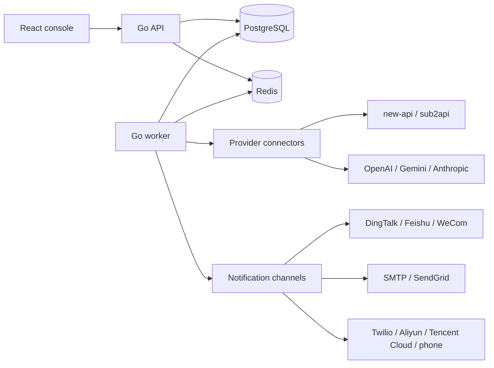

# API Monitor

[](https://github.com/baogutang/api-monitor/actions/workflows/ci.yml)
[](https://github.com/baogutang/api-monitor/actions/workflows/release.yml)
[](https://github.com/baogutang/api-monitor/releases)
[](https://github.com/baogutang/api-monitor/pkgs/container/api-monitor)
[](LICENSE)

API Monitor is a self-hosted control plane for watching AI relay balances,
official account quotas, API key health, subscription windows, and alert
delivery across teams.

It is built for operators who run many upstream accounts across new-api,
sub2api, official OpenAI/Gemini/Anthropic accounts, and manually tracked plans.
Relay providers are treated as normal user accounts by default. You do not need
upstream admin privileges for the new-api and sub2api user connectors.

## Why This Exists

AI relay operations usually fail in quiet, expensive ways:

- a relay user balance reaches zero before anyone notices;
- a 5-hour or 7-day official account window is exhausted mid-workflow;
- one API key is healthy while another key in the same upstream account is not;
- notification channels exist, but no one has tested the real webhook payload;
- a Docker deployment is running, but the operator cannot see whether a newer
  release is available.

API Monitor puts those failure modes into one console: upstream instances,
discovered monitor assets, scan runs, alert rules, notification templates,
version checks, and Docker-friendly deployment.

## Highlights

- **Relay-aware monitoring** for new-api and sub2api normal user accounts.
- **API key discovery** for relay-created keys where the upstream exposes them.
- **Official account monitoring** for OpenAI, Gemini, and Anthropic style account
  sessions, including time-window quota display when the upstream data is
  available.
- **Official API key health checks** for OpenAI and Anthropic keys.
- **Alert rules** scoped globally, by provider, by group, by upstream instance,
  or by individual monitor asset.
- **Real notification channels** for DingTalk, Feishu/Lark, WeCom, webhook,
  SMTP, SendGrid, Twilio SMS, Aliyun SMS, Tencent Cloud SMS, and phone
  escalation providers.
- **Editable message templates** with preview variables and test sends.
- **PostgreSQL persistence** and Redis-backed cache invalidation for runtime
  configuration.
- **Encrypted credentials at rest** using AES-GCM derived from `APP_SECRET`.
- **One-container web console** served by the Go API in production.
- **GitHub release and GHCR builds** for Linux/macOS tarballs and multi-arch
  Docker images.

## Supported Upstreams

| Upstream type | What is monitored | Admin access required |
| --- | --- | --- |
| new-api user login | User balance, quota-style fields, discovered API keys when exposed | No |
| new-api API key | Key health and key metadata returned by the upstream | No |
| sub2api user login | User balance, platform quotas, subscriptions, discovered API keys | No |
| sub2api API key | Key health through OpenAI-compatible endpoints | No |
| OpenAI official account | Account health and official quota windows when available | No |
| Gemini official account | Account health and available account metadata | No |
| Anthropic official account | Account health and usage windows when available | No |
| OpenAI Admin API | Organization usage/cost from official admin endpoints | Yes |
| OpenAI / Anthropic API key | Key health through official API endpoints | No |
| Manual subscription | Manually entered plan balance, expiry, and quota | No |
| Generic HTTP | JSON-extracted balance/quota from a custom endpoint | No |

Official providers do not expose every balance field through public APIs. API
Monitor shows real upstream data when it is available and keeps manual metadata
separate when the operator has to enter plan information by hand.

## Architecture



The API process serves both JSON endpoints and the built frontend. The worker
process scans enabled upstream instances on an interval and writes normalized
monitor targets, snapshots, scan runs, and alert state into PostgreSQL.

## Quick Start

The fastest production-like start is Docker Compose:

```bash
git clone https://github.com/baogutang/api-monitor.git
cd api-monitor
cp .env.example .env
docker compose up -d --build
```

Open:

```text
http://localhost:8080
```

Create the first admin user from the setup page. The API and worker both run
database migrations automatically on startup.

## Release Image Deployment

For a server or NAS, use the release compose file with the prebuilt GHCR image:

```bash
mkdir -p api-monitor
cd api-monitor
curl -fsSLO https://raw.githubusercontent.com/baogutang/api-monitor/main/docker-compose.release.yml

cat > .env <<'EOF'
HTTP_PORT=5090
API_MONITOR_IMAGE=ghcr.io/baogutang/api-monitor:latest
POSTGRES_PASSWORD=replace-with-a-strong-password
APP_SECRET=replace-with-at-least-32-random-characters
DEFAULT_SCAN_INTERVAL_SECONDS=60
GITHUB_REPO=baogutang/api-monitor
ENABLE_SELF_UPDATE=false
EOF

docker compose -f docker-compose.release.yml up -d
```

Then open:

```text
http://<server-ip>:5090
```

For long-lived deployments, keep `APP_SECRET` stable. Changing it will prevent
old encrypted credentials from being decrypted.

## Configuration

| Variable | Default | Description |
| --- | --- | --- |
| `APP_ENV` | `development` | Runtime environment label. |
| `APP_SECRET` | development fallback | JWT signing and credential encryption secret. Set a strong value in production. |
| `HTTP_ADDR` | `:8080` | API and web console listen address. |
| `DATABASE_URL` | local PostgreSQL URL | PostgreSQL connection string. |
| `REDIS_ADDR` | `localhost:6379` | Redis address. |
| `REDIS_PASSWORD` | empty | Redis password. |
| `REDIS_DB` | `0` | Redis logical database. |
| `JWT_ISSUER` | `api-monitor` | JWT issuer. |
| `JWT_TTL_HOURS` | `168` | Login token lifetime in hours. |
| `DEFAULT_SCAN_INTERVAL_SECONDS` | `60` | Default scan interval for upstream instances. |
| `MIGRATIONS_DIR` | `migrations` | Database migrations directory. |
| `STATIC_DIR` | `web/dist` | Built frontend directory served by the API. |
| `GITHUB_REPO` | `baogutang/api-monitor` | Repository used by the version check endpoint. |
| `ENABLE_SELF_UPDATE` | `false` | Enables execution of `UPDATE_COMMAND` from the version update endpoint. |
| `UPDATE_COMMAND` | empty | Operator-controlled update command. Keep disabled unless the deployment is trusted. |

## Working With Upstream Accounts

1. Add an upstream instance from **Upstream Instances**.
2. Test the connection from the instance row or draft form.
3. Sync/discover monitor assets.
4. Review grouped assets in **Monitor Assets**.
5. Create alert rules by global scope, provider, group, instance, or asset.
6. Configure at least one notification channel and use the test-send button.

Relay user connectors store the login/session material needed for normal user
queries. They do not call admin-only upstream APIs by default.

## Notification Channels

Supported channel families:

- instant messaging: DingTalk, Feishu/Lark, WeCom;
- HTTP: generic webhook;
- email: SMTP, SendGrid;
- SMS: Twilio, Aliyun SMS, Tencent Cloud SMS;
- voice escalation: provider-backed phone notification settings.

Templates support variables such as `{{title}}`, `{{message}}`,
`{{severity}}`, `{{status}}`, `{{targetName}}`, `{{provider}}`, `{{group}}`,
`{{balance}}`, `{{quota}}`, and `{{health}}`. The UI previews the rendered
message and can send a real test payload before the channel is saved.

## Development

Run dependencies:

```bash
docker compose up -d postgres redis
```

Run the backend:

```bash
go run ./cmd/api-monitor api
go run ./cmd/api-monitor worker
```

Run the frontend in Vite during UI development:

```bash
cd web
npm ci
npm run dev
```

Useful checks:

```bash
go test ./...
npm --prefix web run build
docker build -t api-monitor:local .
```

## API Surface

The main backend routes are:

- `GET /healthz`
- `GET /api/v1/setup/status`
- `POST /api/v1/setup`
- `POST /api/v1/auth/login`
- `GET /api/v1/dashboard/summary`
- `GET|POST /api/v1/instances`
- `POST /api/v1/instances/test-draft`
- `POST /api/v1/instances/{id}/test`
- `POST /api/v1/instances/{id}/discover`
- `GET /api/v1/targets`
- `POST /api/v1/targets/{id}/scan`
- `GET|POST|PATCH|DELETE /api/v1/alert-rules`
- `GET /api/v1/alerts`
- `GET|POST|PATCH|DELETE /api/v1/notification-channels`
- `POST /api/v1/notification-channels/test-draft`
- `GET /api/v1/scan-runs`
- `GET|PATCH /api/v1/settings`
- `GET /api/v1/version`
- `POST /api/v1/version/check`

See [docs/api-contract.openapi.yaml](docs/api-contract.openapi.yaml) for the
OpenAPI contract used by the frontend.

## Releases

Every tag matching `v*` triggers `.github/workflows/release.yml`.

```bash
git tag v1.0.0
git push origin v1.0.0
```

The workflow publishes:

- `api-monitor_<version>_linux_amd64.tar.gz`
- `api-monitor_<version>_linux_arm64.tar.gz`
- `api-monitor_<version>_darwin_amd64.tar.gz`
- `api-monitor_<version>_darwin_arm64.tar.gz`
- `ghcr.io/baogutang/api-monitor:<version>`
- `ghcr.io/baogutang/api-monitor:latest`

The Settings page can check GitHub Releases through `GITHUB_REPO` and show
whether the deployed build is behind the latest release.

## Security Notes

- Set a strong `APP_SECRET` before entering real upstream credentials.
- Keep `APP_SECRET` stable across upgrades so encrypted credentials remain
  readable.
- Do not expose the app directly to the public internet without an outer access
  layer such as a VPN, reverse proxy authentication, or SSO.
- Keep `ENABLE_SELF_UPDATE=false` unless you fully trust the deployment network
  and the configured update command.
- Rotate upstream tokens if a deployment secret or database backup is exposed.

## License

API Monitor is released under the [MIT License](LICENSE).
