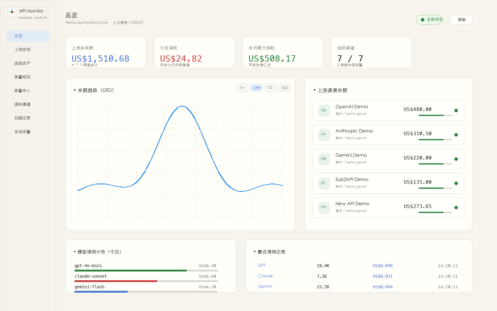
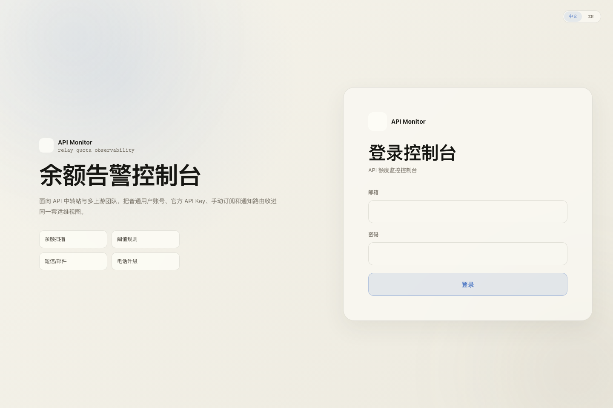
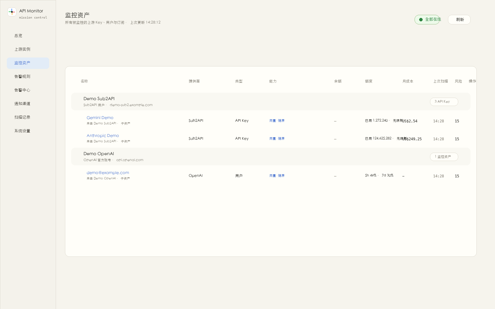
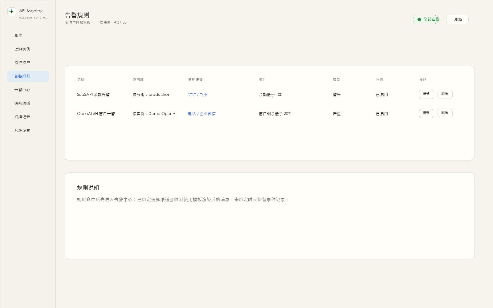
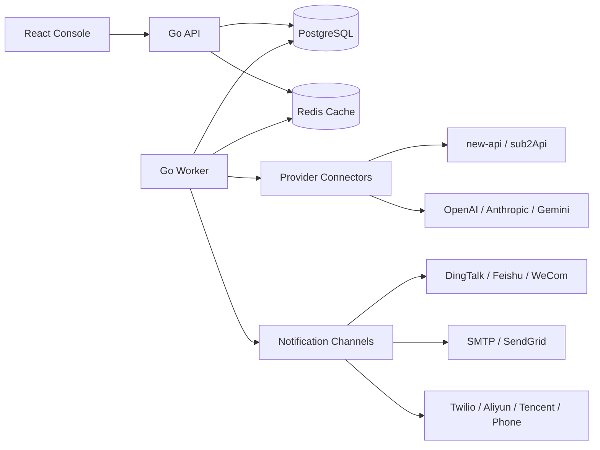

# API Monitor

<p align="center">
  
</p>

<p align="center">
  <a href="https://github.com/baogutang/api-monitor/actions/workflows/ci.yml"></a>
  <a href="https://github.com/baogutang/api-monitor/actions/workflows/release.yml"></a>
  <a href="https://github.com/baogutang/api-monitor/releases"></a>
  <a href="https://github.com/baogutang/api-monitor/pkgs/container/api-monitor"></a>
  <a href="LICENSE"></a>
</p>

<p align="center">
  <b>面向 API 中转站、多上游团队和官方账号的余额、额度、套餐窗口、公告、模型与价格变更监控控制台。</b>
</p>

API Monitor 是一个可自托管的 AI API 运维控制台。它把 new-api、sub2Api、官方 OpenAI / Anthropic / Gemini 账号、官方 API Key、手动订阅、通知渠道和告警规则收进同一个视图。
它默认把上游中转站当成“普通用户账号”处理，不依赖上游 admin 权限。

> English: API Monitor is a self-hosted control plane for AI relay balances, official account quotas, API key health, content-source changes, and real alert delivery.

## 脱敏演示截图

<table>
  <tr>
    <td></td>
  </tr>
  <tr>
    <td></td>
  </tr>
  <tr>
    <td></td>
  </tr>
</table>

截图为脱敏演示数据，只展示页面能力与布局，不包含真实上游域名、账号、Token、API Key 或余额信息。

## 核心能力

- **余额与额度监控**：用户余额、API Key 额度、套餐有效期、月成本、健康状态、官方账号时间窗口。
- **中转站普通用户接入**：new-api / sub2Api 支持账号密码登录、API Key 发现、资产同步，不要求上游 admin 权限。
- **官方账号接入**：OpenAI、Anthropic、Gemini 支持官方账号授权形态；官方 API Key 支持健康探测。
- **内容源变更监控**：中转站公告、分组、倍率、模型目录、价格表；官方新闻、模型目录、下架公告、价格页。
- **可选告警通道**：每条规则可绑定不同通知渠道，余额告警和内容变更可以走不同推送模板。
- **真实通知测试**：钉钉、飞书、企业微信、Webhook、SMTP、SendGrid、Twilio、阿里云短信、腾讯云短信、电话升级都按真实配置发送测试。
- **Docker / NAS 友好**：一个 Go 服务同时提供 API 和前端静态资源，PostgreSQL 持久化，Redis 做配置缓存与失效同步。
- **自动发布**：GitHub Actions 构建 Linux / macOS 产物与多架构 GHCR 镜像，页面可检查最新版本。

## 新增：内容源观察站

API Monitor 会把“公告、分组、模型、价格”这类上游信息同步为独立监控资产。每次扫描会计算稳定指纹，只有真实内容变化才触发对应规则。

| 来源 | 可预览 | 可监控变化 | 典型规则 |
| --- | --- | --- | --- |
| new-api | `/api/notice`、用户分组、模型列表、价格/倍率配置 | 公告更新、分组变化、倍率变化、模型变化、价格变化 | `announcement_changed`、`group_catalog_changed`、`model_catalog_changed`、`pricing_changed` |
| sub2Api | 公告、可用分组、分组倍率、可用渠道、平台额度 | 公告更新、分组/倍率变化、模型或渠道变化、价格变化 | `announcement_changed`、`group_catalog_changed`、`model_catalog_changed`、`pricing_changed` |
| OpenAI | 官方 changelog、models、pricing、deprecations | 新模型、模型下架、价格页调整、平台新闻 | `news_changed`、`model_catalog_changed`、`deprecation_changed`、`pricing_changed` |
| Anthropic | API release notes、models、pricing、model deprecations | 新模型、下架窗口、价格页调整、API 变更 | `news_changed`、`model_catalog_changed`、`deprecation_changed`、`pricing_changed` |
| Gemini | Gemini API changelog、models、pricing、deprecations | 新模型、下架公告、价格调整、API 新闻 | `news_changed`、`model_catalog_changed`、`deprecation_changed`、`pricing_changed` |

官方信息源使用公开官方文档页面或官方模型接口：
[OpenAI changelog](https://developers.openai.com/api/docs/changelog)、
[OpenAI pricing](https://developers.openai.com/api/docs/pricing)、
[Anthropic API release notes](https://docs.anthropic.com/en/release-notes/api)、
[Anthropic pricing](https://docs.anthropic.com/en/docs/about-claude/pricing)、
[Gemini changelog](https://ai.google.dev/gemini-api/docs/changelog)、
[Gemini pricing](https://ai.google.dev/gemini-api/docs/pricing)。

## 支持的上游

| 上游类型 | 监控内容 | 是否需要 admin |
| --- | --- | --- |
| new-api 用户登录 | 用户余额、额度字段、API Key、公告、分组、倍率、模型、价格 | 否 |
| new-api API Key | Key 可用性、用量接口返回数据 | 否 |
| sub2Api 用户登录 | 用户余额、平台额度窗口、订阅、API Key、公告、分组倍率、渠道 | 否 |
| sub2Api API Key | OpenAI 兼容 `/v1/models` 可用性探测 | 否 |
| OpenAI 官方账号 | 账号健康、5H / 7D 等窗口、官方新闻、模型、下架、价格 | 否 |
| Gemini 官方账号 | Google 授权、账号健康、官方新闻、模型、下架、价格 | 否 |
| Anthropic 官方账号 | Claude 授权、5H / 7D 等窗口、官方新闻、模型、下架、价格 | 否 |
| OpenAI Admin API | 组织用量与成本 | 是 |
| OpenAI / Anthropic API Key | 官方 API Key 健康检查、模型目录 | 否 |
| 手动订阅 | 人工录入余额、额度、过期时间 | 否 |
| 通用 HTTP | 从自定义 JSON 接口提取余额和额度 | 否 |

## 告警和通知

规则支持这些作用域：

- 全局
- 上游类型
- 分组
- 上游实例
- 单个监控资产

规则支持这些条件：

- 余额低于阈值
- 剩余额度低于阈值
- 剩余百分比低于阈值
- 距离过期小于 N 天
- 健康状态异常
- 月成本高于阈值
- 上游公告更新
- 官方新闻更新
- 模型下架信息更新
- 分组/倍率目录更新
- 模型目录更新
- 价格目录更新
- 任意观察源内容变化

通知模板支持变量：

```text
{{title}} {{message}} {{severity}} {{status}} {{openedAt}}
{{targetName}} {{provider}} {{group}} {{balance}} {{quota}} {{health}}
{{targetKind}} {{changeType}} {{changeTitle}} {{changeSummary}}
{{changeUrl}} {{changeFingerprint}}
```

每个通道都可以保存前发送真实测试 payload。内容变更类告警会自动带上最新标题、摘要、来源 URL 和指纹，方便判断是公告、模型、价格还是分组变化。

## 架构



## 快速开始

```bash
git clone https://github.com/baogutang/api-monitor.git
cd api-monitor
cp .env.example .env
docker compose up -d --build
```

打开：

```text
http://localhost:8080
```

首次进入会跳转初始化页，创建第一个管理员后即可进入控制台。

## NAS / 服务器部署

使用发布镜像：

```bash
mkdir -p api-monitor
cd api-monitor
curl -fsSLO https://raw.githubusercontent.com/baogutang/api-monitor/main/docker-compose.release.yml

cat > .env <<'EOF'
HTTP_PORT=5090
API_MONITOR_IMAGE=ghcr.io/baogutang/api-monitor:latest
POSTGRES_PASSWORD=replace-with-a-strong-password
APP_SECRET=replace-with-at-least-32-random-characters
DEFAULT_SCAN_INTERVAL_SECONDS=60
GITHUB_REPO=baogutang/api-monitor
ENABLE_SELF_UPDATE=false
EOF

docker compose -f docker-compose.release.yml up -d
```

打开：

```text
http://<server-ip>:5090
```

生产环境必须固定 `APP_SECRET`。它用于 JWT 签名和凭证 AES-GCM 加密，变更后旧凭证将无法解密。

## 配置项

| 变量 | 默认值 | 说明 |
| --- | --- | --- |
| `APP_ENV` | `development` | 运行环境标签 |
| `APP_SECRET` | 开发默认值 | JWT 与凭证加密密钥，生产必须设置强随机值 |
| `HTTP_ADDR` | `:8080` | API 与前端监听地址 |
| `DATABASE_URL` | 本地 PostgreSQL | PostgreSQL 连接串 |
| `REDIS_ADDR` | `localhost:6379` | Redis 地址 |
| `REDIS_PASSWORD` | 空 | Redis 密码 |
| `REDIS_DB` | `0` | Redis DB |
| `JWT_ISSUER` | `api-monitor` | JWT issuer |
| `JWT_TTL_HOURS` | `168` | 登录 token 有效期 |
| `DEFAULT_SCAN_INTERVAL_SECONDS` | `60` | 默认扫描间隔 |
| `MIGRATIONS_DIR` | `migrations` | 迁移目录 |
| `STATIC_DIR` | `web/dist` | 前端构建产物目录 |
| `GITHUB_REPO` | `baogutang/api-monitor` | 页面检查更新使用的 GitHub 仓库 |
| `ENABLE_SELF_UPDATE` | `false` | 是否允许页面触发更新命令 |
| `UPDATE_COMMAND` | 空 | 自定义更新命令，仅可信部署环境开启 |

## 开发

```bash
docker compose up -d postgres redis
go run ./cmd/api-monitor api
go run ./cmd/api-monitor worker
```

前端开发：

```bash
cd web
npm ci
npm run dev
```

常用检查：

```bash
go test ./...
npm --prefix web run build
docker build -t api-monitor:local .
```

## GitHub About 推荐配置

为了让更多人通过 GitHub 搜到，建议这样设置：

- Description: `Self-hosted AI API balance, quota, model, pricing and alert monitor for OpenAI, Anthropic, Gemini, new-api and sub2Api.`
- Website: `https://github.com/baogutang/api-monitor/releases/latest`
- Topics: `ai-monitoring`, `api-monitor`, `openai`, `anthropic`, `gemini`, `new-api`, `sub2api`, `docker`, `self-hosted`, `alerting`, `dingtalk`, `feishu`, `wecom`, `postgresql`, `redis`, `golang`, `react`, `model-pricing`, `quota-monitor`

维护者可以直接执行：

```bash
gh repo edit baogutang/api-monitor \
  --description "Self-hosted AI API balance, quota, model, pricing and alert monitor for OpenAI, Anthropic, Gemini, new-api and sub2Api." \
  --homepage "https://github.com/baogutang/api-monitor/releases/latest" \
  --add-topic ai-monitoring \
  --add-topic api-monitor \
  --add-topic openai \
  --add-topic anthropic \
  --add-topic gemini \
  --add-topic new-api \
  --add-topic sub2api \
  --add-topic docker \
  --add-topic self-hosted \
  --add-topic alerting \
  --add-topic dingtalk \
  --add-topic feishu \
  --add-topic wecom \
  --add-topic postgresql \
  --add-topic redis \
  --add-topic golang \
  --add-topic react \
  --add-topic model-pricing \
  --add-topic quota-monitor
```

## 发布

每个 `v*` tag 会触发 `.github/workflows/release.yml`：

- 构建 Linux / macOS 二进制包
- 构建并推送多架构 Docker 镜像到 GHCR
- 生成以部署和升级为主的 GitHub Release 说明

```bash
VERSION=vX.Y.Z
git tag "${VERSION}"
git push origin "${VERSION}"
```

Release 页面会展示：

- Docker 镜像地址和支持架构
- Docker Compose 首次部署步骤
- 已有部署升级步骤
- 二进制包文件说明
- 版本检查、自更新和回滚说明

发布后 Docker 用户通常只需要更新 `.env` 中的镜像 tag：

```bash
API_MONITOR_IMAGE=ghcr.io/baogutang/api-monitor:vX.Y.Z
docker compose -f docker-compose.release.yml pull api worker
docker compose -f docker-compose.release.yml up -d
```

## 安全说明

- 上游密码、OAuth token、Webhook secret、短信密钥会加密保存。
- new-api / sub2Api 用户连接器默认不调用 admin-only 接口。
- 页面自更新默认关闭，只有显式设置 `ENABLE_SELF_UPDATE=true` 和 `UPDATE_COMMAND` 才会执行。
- 建议给 API Monitor 单独部署数据库和 Redis，不要与其他业务共用凭证。

## License

[MIT](LICENSE)
